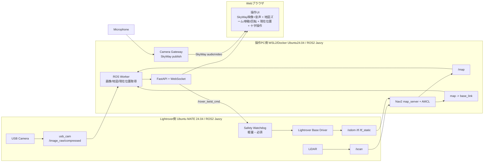

# Lightrover Web Teleop + SkyWay + 高精度地図表示 V8（PC重処理 / Lightrover軽量版）

このプロジェクトは、LightroverをWebブラウザから遠隔操作し、USBカメラ映像をSkyWayで表示し、さらにLiDARで作成した地図上に現在位置を高精度に表示するための一式です。

今回の版は **可能な限りLightrover側を軽くし、重い処理を操作PC側へ寄せる構成** です。V8ではV7の地図表示操作・カメラズーム・明るさ調整・写真撮影に加えて、SkyWayでマイク音声も同時に配信できます。

---

## 1. 最終構成



---

## 2. 処理分担

### Lightrover側に残すもの

| 処理 | 理由 |
|---|---|
| `usb_cam` | USBカメラがLightroverに接続されているため |
| LiDAR driver | LiDARがLightroverに接続されているため |
| base driver / odom | モータ・エンコーダがLightrover側にあるため |
| `odom -> base_link` TF | AMCLに必要 |
| `base_link -> laser_frame` TF | AMCLに必要 |
| Safety Watchdog | PCやWi-Fiが落ちてもLightrover単体で停止させるため |

### PC側へ移すもの

| 処理 | 理由 |
|---|---|
| Nav2 `map_server` | 地図読み込みをPC側へ移す |
| AMCL | LiDAR照合処理をPC側へ移す |
| Webサーバ | 操作画面提供 |
| SkyWay処理 | 映像通信処理をPC側へ移す |
| 地図描画・現在位置表示・地図表示操作 | Web UI処理のためPC側が自然 |

---

## 3. ディレクトリ構成

```text
lightrover_web_teleop_skyway/
├── README.md
├── requirements.txt
├── .env.example
├── config/
│   └── robots.yaml
├── maps/
│   ├── 1F.yaml
│   ├── 1F.pgm
│   ├── 2F.yaml
│   ├── 2F.pgm
│   ├── test.yaml
│   └── test.pgm
├── docs/
│   └── ARCHITECTURE.md
├── nav2/
│   └── amcl_params_lightrover.yaml
├── server/
│   ├── run_server.py
│   ├── config_loader.py
│   ├── ros_worker.py
│   └── skyway_token.py
├── web/
│   ├── index.html
│   ├── camera_gateway.html
│   ├── app.js
│   ├── camera_gateway.js
│   └── style.css
├── scripts/
│   ├── launch_usb_cam_lightrover.sh
│   ├── launch_lightrover_mic_publisher.sh
│   ├── launch_safety_watchdog_lightrover.sh
│   ├── launch_pc_localization.sh
│   ├── lightrover_mic_publisher.py
│   ├── check_lightrover_topics.sh
│   └── check_pc_pose.sh
└── lightrover_safety_watchdog/
    └── ROS2 package
```

---

## 4. 前提条件

### Lightrover側

- Ubuntu MATE 24.04
- ROS2 Jazzy
- CycloneDDS
- USBカメラ
- LiDAR
- `/rover_twist` で動作するLightrover制御ノード
- `/odom`, `/scan`, `/tf`, `/tf_static` が出ること

### 操作PC側

- Ubuntu 24.04 / WSL2 / Docker Ubuntu24.04
- ROS2 Jazzy
- CycloneDDS
- Python 3.12
- SkyWayアカウント

---

## 5. ZIP展開

操作PC側では、ZIPをホームディレクトリ直下へ展開する例で説明します。

```bash
cd ~
unzip lightrover_web_teleop_skyway.zip -d lightrover_web_teleop_skyway
cd ~/lightrover_web_teleop_skyway
```

すでに同名ディレクトリがある場合は、必要に応じてバックアップしてから展開してください。

```bash
cd ~
mv lightrover_web_teleop_skyway lightrover_web_teleop_skyway_backup_$(date +%Y%m%d_%H%M%S)
unzip lightrover_web_teleop_skyway.zip -d lightrover_web_teleop_skyway
```

---

## 6. 共通ROS2環境変数

Lightrover側とPC側で、対象ロボットごとに同じ `ROS_DOMAIN_ID` を使います。

例：Lightrover 1

```bash
export ROS_DOMAIN_ID=1
export RMW_IMPLEMENTATION=rmw_cyclonedds_cpp
export ROS_LOCALHOST_ONLY=0
```

Lightrover 2なら `ROS_DOMAIN_ID=2` のように分けます。

---

## 7. Lightrover側セットアップ

### 7.1 必要パッケージ

```bash
sudo apt update
sudo apt install -y \
  ros-jazzy-usb-cam \
  ros-jazzy-image-transport \
  ros-jazzy-compressed-image-transport \
  ros-jazzy-tf2-ros \
  alsa-utils \
  python3-colcon-common-extensions
```

LiDARドライバは使用中のものを入れてください。YDLiDARの場合は既存の `ydlidar_ros2_driver` を使用します。

---

### 7.2 Safety WatchdogをLightroverへ配置

このZIP内の `lightrover_safety_watchdog` をLightroverへコピーします。

例：

```bash
mkdir -p ~/lightrover_safety_ws/src
cp -r lightrover_safety_watchdog ~/lightrover_safety_ws/src/
cd ~/lightrover_safety_ws
source /opt/ros/jazzy/setup.bash
colcon build --symlink-install
source install/setup.bash
```

確認：

```bash
ros2 run lightrover_safety_watchdog safety_watchdog --help
```

---

### 7.3 USBカメラ起動

重要：`framerate` は **整数ではなく double型** で指定します。

正しい例：

```bash
source /opt/ros/jazzy/setup.bash
export ROS_DOMAIN_ID=1
export RMW_IMPLEMENTATION=rmw_cyclonedds_cpp
export ROS_LOCALHOST_ONLY=0

ros2 run usb_cam usb_cam_node_exe --ros-args \
  -p video_device:=/dev/video0 \
  -p image_width:=640 \
  -p image_height:=480 \
  -p framerate:=15.0 \
  -p pixel_format:=mjpeg2rgb
```

誤り：

```bash
-p framerate:=15
```

これは `InvalidParameterTypeException` になります。

確認：

```bash
ros2 topic list | grep image
ros2 topic hz /image_raw/compressed
```

実機で動作確認済みのトピック名は以下です。

```text
/image_raw
/image_raw/compressed
```

このプロジェクトのデフォルトは `/image_raw/compressed` です。

---

### 7.4 USBマイク音声publisher起動

Lightroverに接続されたマイクを、ブラウザなしでROS2トピックへ流します。

まずLightrover側でマイクデバイスを確認します。

```bash
arecord -l
arecord -D default -f S16_LE -r 16000 -c 1 -d 3 /tmp/mic_test.wav
```

音声publisherを起動します。

```bash
cd ~/lightrover_web_teleop_skyway
source /opt/ros/jazzy/setup.bash
export ROS_DOMAIN_ID=1
export RMW_IMPLEMENTATION=rmw_cyclonedds_cpp
export ROS_LOCALHOST_ONLY=0

./scripts/launch_lightrover_mic_publisher.sh
```

ALSAデバイスを指定する場合：

```bash
LIGHTROVER_AUDIO_DEVICE=plughw:1,0 ./scripts/launch_lightrover_mic_publisher.sh
```

PC側から確認：

```bash
ros2 topic hz /lightrover/audio/pcm_s16le
```

標準では 16kHz / mono / signed 16-bit little endian PCM を `/lightrover/audio/pcm_s16le` にpublishします。

---

### 7.5 LiDAR / odom / TF 起動

既存のLightrover起動手順で以下が出る状態にします。

```bash
ros2 topic list
```

最低限必要：

```text
/scan
/odom
/tf
/tf_static
/rover_twist
```

確認：

```bash
ros2 run tf2_ros tf2_echo odom base_link
ros2 run tf2_ros tf2_echo base_link laser_frame
```

`base_link -> laser_frame` が無い場合は、実機の取付位置に合わせて静的TFを出してください。

例：

```bash
ros2 run tf2_ros static_transform_publisher \
  0 0 0.12 0 0 0 \
  base_link laser_frame
```

---

### 7.5 Safety Watchdog起動

PC側から直接 `/rover_twist` へ送らず、以下のように分けます。

```text
PC/Web側:        /rover_twist_cmd
Lightrover実制御: /rover_twist
```

Watchdogが中継し、通信断時にゼロ速度を出します。

```bash
source /opt/ros/jazzy/setup.bash
source ~/lightrover_safety_ws/install/setup.bash
export ROS_DOMAIN_ID=1
export RMW_IMPLEMENTATION=rmw_cyclonedds_cpp
export ROS_LOCALHOST_ONLY=0

ros2 run lightrover_safety_watchdog safety_watchdog --ros-args \
  -p input_topic:=/rover_twist_cmd \
  -p output_topic:=/rover_twist \
  -p timeout_sec:=0.35 \
  -p publish_hz:=20.0 \
  -p enabled:=true
```

動作確認：

```bash
ros2 topic echo /rover_twist --once
```

PC側からコマンドが来ない場合、ゼロ速度が出続けます。
Web画面の `Safety watchdog` でON/OFFできます。OFF時は切替時に一度ゼロ速度を出し、その後は受信した速度指令だけを中継します。

---

## 8. 操作PC側セットアップ

### 8.1 ROS2 / Nav2 / CycloneDDS

```bash
sudo apt update
sudo apt install -y \
  ros-jazzy-desktop \
  ros-jazzy-navigation2 \
  ros-jazzy-nav2-bringup \
  ros-jazzy-tf2-tools \
  ros-jazzy-rmw-cyclonedds-cpp
```

---

### 8.2 Python venv準備

Ubuntu 24.04ではPEP 668により、システムPythonへ直接pip installしようとすると `externally-managed-environment` になります。必ずvenvを使います。

```bash
cd ~/lightrover_web_teleop_skyway

sudo apt update
sudo apt install -y python3.12-venv python3-pip python3-full

rm -rf .venv
source /opt/ros/jazzy/setup.bash
python3 -m venv --system-site-packages .venv
source .venv/bin/activate

python -m pip install -U pip setuptools wheel
python -m pip install -r requirements.txt
python -m pip install jinja2 typeguard
```

確認：

```bash
python -c "import fastapi, uvicorn, yaml, jwt, cv2; print('web deps OK')"
python -c "import rclpy; print('rclpy OK')"
```

---

### 8.3 SkyWay設定

`.env.example` をコピーします。

```bash
cp .env.example .env
nano .env
```

設定例：

```env
SKYWAY_APP_ID=xxxxxxxxxxxxxxxx
SKYWAY_SECRET_KEY=yyyyyyyyyyyyyyyy
SKYWAY_ROOM_PREFIX=lightrover
WEB_HOST=0.0.0.0
WEB_PORT=8080
```

`SKYWAY_SECRET_KEY` はブラウザに出さず、Pythonサーバ側だけで使用します。

---

### 8.4 robots.yaml設定

`config/robots.yaml` を実機に合わせて編集します。

```yaml
robots:
  - id: lightrover1
    name: Lightrover 1
    ros_domain_id: 1
    cmd_vel_topic: /rover_twist_cmd
    motor_cmd_vel_topic: /rover_twist
    image_topic: /image_raw/compressed
    image_type: compressed
    map_topic: /map
    scan_topic: /scan
    odom_frame: odom
    map_frame: map
    base_frame: base_link
    linear_speed: 0.18
    angular_speed: 0.7
    command_hz: 15
    watchdog_timeout_sec: 0.35
    watchdog_enabled: true
    watchdog_service_name: /lightrover_safety_watchdog/set_parameters
    camera_fps: 10
    jpeg_quality: 70
```

実機で確認済みのカメラトピック：

```text
/image_raw/compressed
```

---

## 9. PC側でNav2 localization / AMCLを起動

地図ファイルは、このプロジェクトディレクトリ直下の `maps` に配置します。

例：

```text
$(pwd)/maps/1F.yaml
$(pwd)/maps/1F.pgm
```

まだ `maps` ディレクトリがない場合は作成し、作成済みの地図ファイルを配置してください。

```bash
cd ~/lightrover_web_teleop_skyway
mkdir -p maps
cp /path/to/your_map.yaml maps/1F.yaml
cp /path/to/your_map.pgm maps/1F.pgm
```

PC側で起動：

```bash
cd ~/lightrover_web_teleop_skyway
source /opt/ros/jazzy/setup.bash
export ROS_DOMAIN_ID=1
export RMW_IMPLEMENTATION=rmw_cyclonedds_cpp
export ROS_LOCALHOST_ONLY=0

ros2 launch nav2_bringup localization_launch.py \
  map:=$(pwd)/maps/1F.yaml \
  params_file:=$(pwd)/nav2/amcl_params_lightrover.yaml \
  use_sim_time:=false
```

確認：

```bash
ros2 topic list | grep -E "map|amcl|scan|odom|tf"
ros2 topic echo /map --once
ros2 topic echo /amcl_pose --once
```

最重要確認：

```bash
ros2 run tf2_ros tf2_echo map base_link
```

`Translation:` が出れば、Web地図上に現在位置を表示できます。

---

## 10. Webサーバ起動

別ターミナルで実行します。

```bash
cd ~/lightrover_web_teleop_skyway
source /opt/ros/jazzy/setup.bash
source .venv/bin/activate
export RMW_IMPLEMENTATION=rmw_cyclonedds_cpp
export ROS_LOCALHOST_ONLY=0

python server/run_server.py
```

ブラウザで開く：

```text
http://localhost:8080/camera-gateway
http://localhost:8080/
```

必ず先に `/camera-gateway` を開きます。

---

## 11. 起動順まとめ

### Lightrover側

1. Lightrover基本ノード起動
2. LiDAR起動
3. USBカメラ起動
4. USBマイク音声publisher起動
5. Safety Watchdog起動

### PC側

6. Nav2 localization / AMCL起動
7. Webサーバ起動
8. `http://localhost:8080/camera-gateway` を開く
9. `SkyWay送信開始` を押す
10. `http://localhost:8080/` を開く
11. `SkyWay映像を受信` を押す
12. 地図と現在位置を確認
13. 車輪を浮かせた状態で前後左右・STOP確認

---

## 12. 完全動作確認チェックリスト

### Lightrover側

```bash
ros2 topic list
```

以下があること：

```text
/image_raw/compressed
/scan
/odom
/tf
/tf_static
/rover_twist
```

カメラ：

```bash
ros2 topic hz /image_raw/compressed
```

LiDAR：

```bash
ros2 topic hz /scan
```

Odometry：

```bash
ros2 topic hz /odom
```

TF：

```bash
ros2 run tf2_ros tf2_echo odom base_link
ros2 run tf2_ros tf2_echo base_link laser_frame
```

Safety Watchdog：

```bash
ros2 topic echo /rover_twist --once
```

---

### PC側

Lightroverのトピックが見えること：

```bash
export ROS_DOMAIN_ID=1
export RMW_IMPLEMENTATION=rmw_cyclonedds_cpp
export ROS_LOCALHOST_ONLY=0

ros2 topic list | grep -E "image|scan|odom|tf"
```

地図：

```bash
ros2 topic echo /map --once
```

AMCL：

```bash
ros2 topic echo /amcl_pose --once
```

現在位置：

```bash
ros2 run tf2_ros tf2_echo map base_link
```

Web依存：

```bash
source .venv/bin/activate
python -c "import rclpy, fastapi, cv2; print('OK')"
```

Webサーバ：

```bash
python server/run_server.py
```

---

## 13. 安全確認

初回は必ず車輪を浮かせて確認してください。

確認項目：

- 前進ボタンで `linear.x > 0`
- 後退ボタンで `linear.x < 0`
- 左旋回で `angular.z > 0`
- 右旋回で `angular.z < 0`
- STOPで即ゼロ
- ボタンを離すとゼロ
- ブラウザを閉じるとゼロ
- Webサーバを停止するとLightrover側Watchdogでゼロ
- `Safety watchdog` をOFF/ONして画面の `remote=ok` 表示が出る

`/rover_twist` 確認：

```bash
ros2 topic echo /rover_twist
```

---

## 14. トラブルシュート

### `/image_raw/compressed` がない

Lightrover側で確認：

```bash
ros2 topic list | grep image
```

実機では以下でした。

```text
/image_raw
/image_raw/compressed
```

`/usb_cam/image_raw/compressed` ではありません。

---

### usb_camのframerateエラー

エラー：

```text
parameter 'framerate' has invalid type
```

修正：

```bash
-p framerate:=15.0
```

`15` ではなく `15.0` です。

---

### PEP 668エラー

エラー：

```text
externally-managed-environment
```

対策：

```bash
sudo apt install -y python3.12-venv python3-full
python3 -m venv --system-site-packages .venv
source .venv/bin/activate
python -m pip install -r requirements.txt
```

---

### `rclpy` が見つからない

venvを `--system-site-packages` 付きで作り直します。

```bash
rm -rf .venv
source /opt/ros/jazzy/setup.bash
python3 -m venv --system-site-packages .venv
source .venv/bin/activate
python -c "import rclpy; print('rclpy OK')"
```

---

### `map -> base_link` が出ない

以下を確認します。

```bash
ros2 topic hz /scan
ros2 topic hz /odom
ros2 topic echo /map --once
ros2 run tf2_ros tf2_echo odom base_link
ros2 run tf2_ros tf2_echo base_link laser_frame
```

AMCLに初期位置が必要な場合はRViz2または `/initialpose` で初期姿勢を与えます。

---

## 15. 推奨パラメータ

| 項目 | 推奨値 |
|---|---|
| カメラ解像度 | 640x480 |
| カメラFPS | 10〜15 |
| ROS画像トピック | `/image_raw/compressed` |
| Web表示FPS | 10 |
| LiDAR | 5〜10Hz |
| cmd送信周期 | 約15Hz |
| Watchdog timeout | 0.35秒 |
| linear_speed | 0.10〜0.20 |
| angular_speed | 0.5〜0.8 |

---

## 16. この版の重要ポイント

- Lightrover側にブラウザは不要
- Lightrover側でAMCLやmap_serverは起動しない
- PC側でNav2 localization / AMCLを起動する
- 映像はROS2 `/image_raw/compressed` からPC側で受け、SkyWayへ送る
- 音声はLightrover側の `/lightrover/audio/pcm_s16le` からPC側で受け、`/camera-gateway` でSkyWayへ送る
- 操作指令は `/rover_twist_cmd` へ送る
- Lightrover側Safety Watchdogが `/rover_twist` へ中継する
- 通信断時はLightrover側だけで停止できる


---

## 17. カメラズーム・明るさ調整・音声配信

V8では、既存の構成・手順・安全停止・地図表示機能を維持したまま、SkyWay映像用のカメラ調整機能、写真撮影機能、マイク音声配信を使用できます。

追加した機能は以下です。

| 機能 | 内容 |
|---|---|
| デジタルズーム | 1.0倍〜3.0倍で中央クロップ＋拡大 |
| 明るさ調整 | 50%〜150%でCanvas上の明るさを補正 |
| 操作画面スライダー | `http://localhost:8080/` のSkyWay映像下に表示 |
| Camera Gatewayスライダー | `http://localhost:8080/camera-gateway` にも表示 |
| 設定同期 | WebSocketで操作画面とCamera Gateway間に反映 |
| 写真撮影 | 操作画面のTeleop下にある `撮影` ボタンでSkyWay受信映像をPNG保存 |
| 音声配信 | Lightrover接続マイクのROS2 PCM音声をSkyWayで同時配信 |
| 受信音量調整 | 操作画面のCamera / SkyWay下部で音量とミュートを調整 |

### 17.1 重要な考え方

このズームと明るさ調整は、Lightrover側のUSBカメラ本体を直接制御するものではありません。

Lightrover側を軽くするため、PC側ブラウザのCanvasで以下の処理を行います。

```text
/image_raw/compressed
  → PC側Webサーバ
  → /camera-gateway
  → Canvasでズーム・明るさ補正
  → Canvas映像をSkyWayへpublish
  → / の操作画面でSkyWay映像・音声をsubscribe

Lightrover USB mic
  → Lightrover側 lightrover_mic_publisher.py
  → /lightrover/audio/pcm_s16le
  → PC側ROS Worker
  → /camera-gateway Web Audio
  → SkyWayへ音声publish
```

そのため、Lightrover側にはブラウザもSkyWay処理も不要です。Lightrover側で行う音声処理は `arecord` によるPCM読み取りとROS2 publishだけです。

### 17.2 画面上の操作

`http://localhost:8080/` のSkyWay映像の下に以下が表示されます。

```text
Zoom        1.0x ～ 3.0x
Brightness 50% ～ 150%
カメラ調整リセット
```

Teleopの下にある `撮影` ボタンを押すと、現在受信しているSkyWay映像の1フレームをPNGとして保存します。

`http://localhost:8080/camera-gateway` 側にも同じ調整UIがあります。
`Audio: publishing ROS mic` と表示されていれば、Lightrover側のROS2音声トピックをSkyWayへ送信しています。

操作画面左側の `Camera / SkyWay` エリア下部にある `音量` スライダーでブラウザ再生音量を調整できます。`ミュート` をONにすると受信音声だけを消音します。

- `Zoom` を上げると、映像中央を拡大します。
- `Brightness` を上げると、映像を明るくします。
- `カメラ調整リセット` を押すと、ズーム1.0倍、明るさ100%に戻ります。

### 17.3 操作順

通常どおり、以下の順に起動します。

```text
1. Lightrover側で usb_cam / LiDAR / base driver / Safety Watchdog を起動
2. Lightrover側で lightrover_mic_publisher.py を起動
3. PC側で Nav2 localization / AMCL を起動
4. PC側で Webサーバを起動
5. PC側で http://localhost:8080/camera-gateway を開く
6. SkyWay送信開始
7. http://localhost:8080/ を開く
8. SkyWay映像を受信
9. 映像下のZoom / Brightnessスライダーを調整
```

### 17.4 `config/robots.yaml` の設定

各ロボット設定に以下の項目を追加できます。

```yaml
camera_zoom_default: 1.0
camera_zoom_min: 1.0
camera_zoom_max: 3.0
camera_zoom_step: 0.1
camera_brightness_default: 1.0
camera_brightness_min: 0.5
camera_brightness_max: 1.5
camera_brightness_step: 0.05
audio_enabled: true
audio_topic: /lightrover/audio/pcm_s16le
audio_sample_rate: 16000
audio_channels: 1
```

標準では以下の意味です。

| 項目 | 意味 |
|---|---|
| `camera_zoom_default` | 初期ズーム倍率 |
| `camera_zoom_min` | 最小ズーム倍率 |
| `camera_zoom_max` | 最大ズーム倍率 |
| `camera_zoom_step` | スライダー刻み |
| `camera_brightness_default` | 初期明るさ。`1.0` が100% |
| `camera_brightness_min` | 最小明るさ。`0.5` が50% |
| `camera_brightness_max` | 最大明るさ。`1.5` が150% |
| `camera_brightness_step` | スライダー刻み |
| `audio_enabled` | Lightroverマイク音声をWebSocket経由でSkyWayへ流すか |
| `audio_topic` | Lightrover側音声publisherが出すROS2トピック |
| `audio_sample_rate` | PCMサンプルレート。標準は16000Hz |
| `audio_channels` | PCMチャンネル数。標準は1ch |

### 17.5 注意点

- このズームは光学ズームではなく、デジタルズームです。
- 3倍に近づくほど画質は粗くなります。
- 明るさ補正はPC側Canvas処理です。USBカメラ本体の露出やゲインを変更するものではありません。
- SkyWayにpublishされる映像そのものにズーム・明るさ補正が反映されます。
- `/camera-gateway` が開かれていないとSkyWayへの映像publishは行われません。
- `/camera-gateway` の `Audio:` 表示が `publishing ROS mic` になっていれば音声もpublishされています。
- ブラウザの自動再生制限により音声が出ない場合は、操作画面の `SkyWay映像を受信` を押し直してください。

### 17.6 動作確認

1つ目のタブでCamera Gatewayを開きます。

```text
http://localhost:8080/camera-gateway
```

ロボットを選択して、SkyWay送信を開始します。

2つ目のタブで操作画面を開きます。

```text
http://localhost:8080/
```

同じロボットを選択して、SkyWay映像を受信します。

その後、操作画面側でZoomとBrightnessを変更します。

期待結果：

```text
/camera-gateway 側のCanvas映像が変化する
/ 側のSkyWay受信映像も変化する
```

変化しない場合は、以下を確認してください。

```text
・/camera-gateway が開いたままになっているか
・/camera-gateway でSkyWay送信開始済みか
・/ と /camera-gateway で同じRobotを選択しているか
・ブラウザConsoleにWebSocketエラーが出ていないか
```


---

## 18. V7追加機能：地図の拡大・縮小、上下左右移動、回転

V7では、Web画面の `Map / Pose` に地図表示操作を追加しています。

### 18.1 追加された操作

| 操作 | 方法 |
|---|---|
| 地図の拡大・縮小 | `地図ズーム` スライダー、または地図上でマウスホイール |
| 地図の上下左右移動 | 地図をドラッグ |
| 地図の回転 | Shiftを押しながら地図を左右へドラッグ |

### 18.2 初期位置設定との使い分け

通常時は、地図をドラッグすると表示範囲を上下左右に移動できます。

`現在位置と向きを地図ドラッグで設定` ボタンを押した後だけ、ドラッグ操作はAMCL初期位置設定になります。

つまり、通常の地図確認操作と初期位置設定操作は以下のように分離しています。

| モード | 地図ドラッグの意味 |
|---|---|
| 通常モード | 地図の表示位置を移動 |
| 初期位置設定モード | ロボットの現在位置と向きを設定 |

### 18.3 現在位置表示との関係

地図を拡大・縮小・移動・回転しても、`map -> base_link` TFから得られるロボット現在位置は、同じ変換でCanvas上へ再描画されます。

そのため、地図を回転表示しても、ロボット矢印は地図に対する向きを保ったまま表示されます。

### 18.4 注意点

- 地図の拡大・縮小・移動・回転はWeb画面上の表示操作です。
- ROS2の `/map` データ自体は変更しません。
- AMCL、Nav2、TFの座標系も変更しません。
