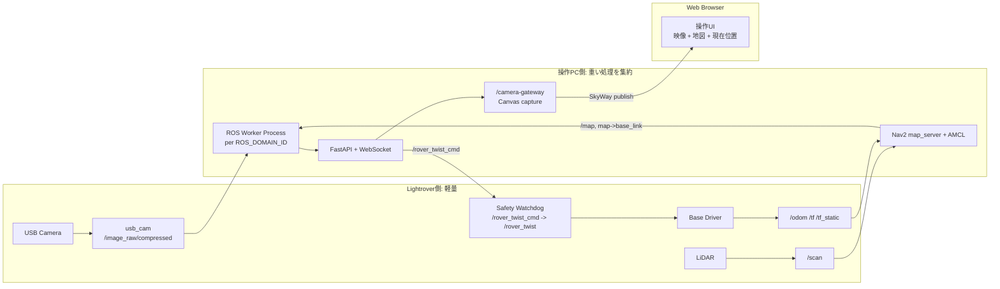
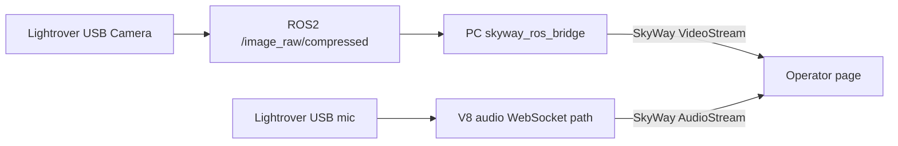

# Lightrover Web Teleop SkyWay Architecture

## Design principles

- Lightrover side should stay lightweight.
- PC side runs map_server, AMCL, Web server, SkyWay camera gateway, and map rendering support.
- Lightrover side still keeps Safety Watchdog because communication failures must stop the robot locally.

---

## V5 Camera Controls

V5 adds PC-side digital camera controls without adding image-processing load to the Lightrover.

The controls are synchronized through the existing WebSocket server using `camera_settings` messages. The actual USB camera exposure or hardware zoom is not changed; V5 uses Canvas-based digital zoom and brightness correction on the PC side.

## V6 Map View Controls

V6 keeps the V5 camera-control architecture and adds browser-side map view transforms. The `/map` OccupancyGrid image and ROS TF coordinates are not modified. The Web UI applies zoom, pan, and rotation only while drawing the map on the Canvas. The map zoom slider controls scale, normal pointer dragging pans the view, and Shift + horizontal dragging rotates the view. When initial-pose mode is enabled, the same drag gesture is reserved for AMCL initial pose setting.

The robot pose arrow uses the same Canvas transform as the map, so the displayed pose remains aligned even when the operator rotates the map view.

## V7 Photo Capture

V7 adds browser-side photo capture on the operator page. The `撮影` button draws the current SkyWay video frame to an in-memory Canvas and saves it as a PNG through the browser download flow. No additional image-processing load is added to the Lightrover side or server side.

## V8 Audio Publish

V8 publishes microphone audio from the Lightrover without requiring a browser on the robot. A lightweight ROS2 node on the Lightrover reads ALSA microphone PCM with `arecord` and publishes `std_msgs/UInt8MultiArray` chunks on `/lightrover/audio/pcm_s16le`. The PC-side ROS worker subscribes to that topic and forwards the PCM chunks over the existing WebSocket to `/camera-gateway`. The gateway reconstructs the PCM through Web Audio, publishes the resulting audio track to SkyWay, and the operator page subscribes to both video and audio publications from the same camera gateway member.

## V9 skyway_ros_bridge Publish

V9 keeps the V8 PC-heavy / Lightrover-lightweight split and adds a PC-side `skyway_ros_bridge` path for video. The Lightrover still only publishes ROS topics such as `/image_raw/compressed`; the PC joins the same SkyWay Room through `skyway_ros_bridge` and publishes that ROS image topic as a SkyWay VideoStream.

The V8 browser camera gateway remains available as a fallback and for audio publishing. `skyway_ros_bridge` currently covers ROS image and string data streams, so the V8 audio path is intentionally retained.
